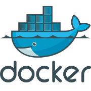

Malcolm's Dockers
=====================
<div align="center"></div>
This repository aims to log some of the data of some of the dockers I made for different projects.
Each docker has his own directory.

## Getting Started
This dockers are on the docker.com hub so you can download each docker with the command:
```
docker pull malkam03/<dockername>
```
But if you want to contribute or see the dockerfile, you can just jump in the respective directory.
### Prerequisites
To use this docker you'll first need to install docker. Depending on your OS the installation binary and instructions can be found at the docker's [page](https://docs.docker.com/engine/installation/#supported-platforms). For Debian based GNU Linux distributions you can just type on a terminal:
```
sudo apt-get remove docker docker-engine docker.io # To remove older docker versions
sudo apt-get update # To update packages indexes
sudo apt-get install apt-transport-https ca-certificates curl software-properties-common # Prerequisites for the instalation method
curl -fsSL https://download.docker.com/linux/ubuntu/gpg | sudo apt-key add - # To add the Dockers repo GPG key
sudo add-apt-repository \
   "deb [arch=amd64] https://download.docker.com/linux/ubuntu \
   $(lsb_release -cs) \
   stable" # To add the new repository to the index
sudo apt-get update
sudo apt-get install docker-ce # To install docker
```
## Dockers
### Haxedevelop
<div align="center"></div>
This docker can be downloaded with:
```
docker pull malkam03/haxedevelop
```
And give you the tools needed to compile with haxe.
I like to add some aliases to bash so is easier to remember the commands, to do it edid the bashrc file:
```
nano ~/.bashrc # To edit the bashrc file
```

Add the following lines on the file:
```
alias dhaxe='sudo docker run --name dhaxe --rm -v "$(pwd)":/tmp/haxe -w /tmp/haxe malkam03/haxedevelop:latest haxe'
alias dhaxelib='sudo docker run --name dhaxelib --rm -v "$(pwd)":/tmp/haxe -w /tmp/haxe malkam03/haxedevelop:latest haxelib'
alias dhaxecompile='sudo docker run --name dhaxelib --rm -v "$(pwd)":/tmp/haxe -w /tmp/haxe malkam03/haxedevelop:latest haxelib run nme build "$(find . -name *.nmml)"'
alias androidupload='$ANDROID_HOME/platform-tools/adb -d install -r $(find . -name *debug.apk)'
```
Lastly reload the aliases:
```
source ~/.bashrc
```
And now you are ready to go, to compile just type on a terminal:
```
dhaxecompile <target>
```
And to upload to the android device type: 
```
androidupload
```
Alternatively you can use the alias dhaxelib to invoke haxelibs from the container, for example to build: 
```
dhaxelib run nme build <project.nmml> <target>
```
## License
This project is licensed under the MIT License - see the [LICENSE.md](LICENSE.md) file for details.


